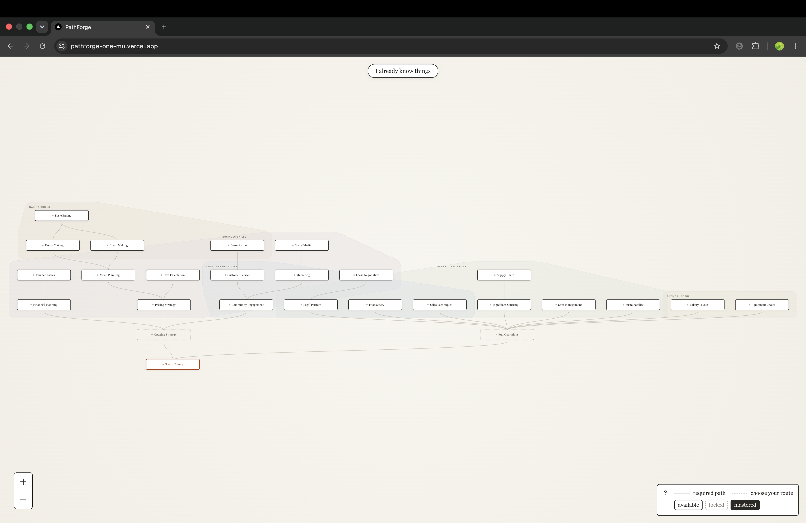
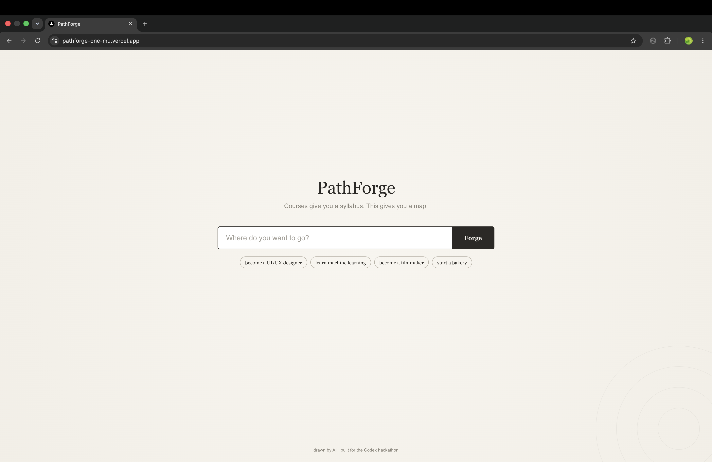
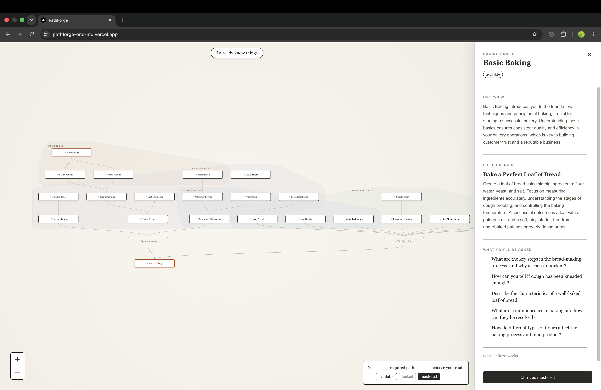
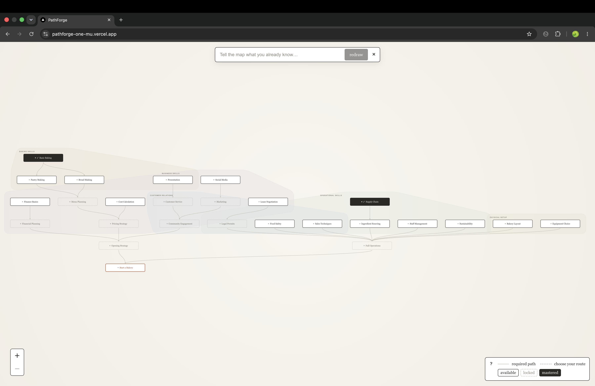

# PathForge 🗺️

**Courses give you a syllabus. This gives you a map.**

Type any learning goal. PathForge draws you an interactive, explorable
skill map — a dependency graph of everything you need to learn, organized
into territories, that teaches you when you click it and redraws itself
around what you already know.

**Live:** https://pathforge-one-mu.vercel.app/

## Why

Every beginner asks the same question: *what should I learn next?* The
internet answers with 400-hour playlists and everyone gets the same list.
PathForge answers with a map instead — personal, structural, and honest
about what depends on what. Roadmap sites give everyone the same picture.
This generates yours, fills every node with real learning content on
demand, and reshapes itself as you learn.

## What it does

**1. Generation.** Any goal — "become a filmmaker", "start a bakery",
"learn machine learning" — becomes a validated dependency graph: 20–35
skills, real prerequisites, parallel tracks, explicit either/or choices
(dashed routes), one summit.

**2. Cartography.** The graph renders as a map: named territories
(soft-tinted regions grouping related skills), three node states
(available / locked / mastered), a layer-by-layer bloom when the map is
first drawn.

**3. Teaching.** Click any node and the map teaches it: an overview in
the context of *your* goal, a hands-on field exercise, five interview
questions, typical effort. Locked nodes show a preview and name what's
waiting behind them.

**4. Reshape.** Tell the map what you already know — in plain, even
misspelled language ("i kno javascript n react alredy") — and it
semantically infers what you've mastered (including implied
prerequisites), then deterministically recomputes your frontier. You can
also mark nodes mastered by hand; the cascade updates everything
downstream.

## How it's built

Next.js (App Router, TypeScript) · React Flow + elkjs for graph layout ·
OpenAI API (gpt-4o) for generation · Tailwind + a custom cartographic
design system (Newsreader serif, paper/ink palette) · deployed on Vercel.

The part I'm proudest of is the **validate → retry → repair pipeline**.
The model proposes; code guarantees. Every generated graph is checked for
referential integrity (no orphan edges), structure (exactly one goal
sink, full reachability — every skill must lead somewhere), and shape
(depth minimums, no starburst graphs). Failures are fed back to the model
with precise error messages for one retry; if that fails too, a
deterministic repair step fixes the graph mechanically. A malformed map
structurally cannot reach the screen. The same philosophy runs the state
system: the model decides *what you know*; the available/locked cascade
is computed deterministically from the edge list.

The rendering follows a visible-by-default rule: nothing in the map can
be stranded hidden by a failed animation — entrance animations are pure
CSS with backwards fill, so the worst failure mode is "no animation,"
never "no map."

## Built with Codex

The entire product was built in pair with OpenAI Codex CLI (gpt-5.5)
over the hackathon window — scaffolding, the layout engine integration,
the design system implementation, and every bug fix. My working loop:
one well-specified prompt per feature, verify in the browser, commit,
next prompt. A few real prompts from the build:

**The kickoff prompt** (scaffolding the entire foundation):

> I'm building "PathForge" — an AI tool that turns any learning goal into
> an interactive, explorable skill tree. Next.js App Router + TypeScript +
> Tailwind. Build the foundation in this order: 1. lib/schema.ts — Zod
> schemas: SkillNode { id, label, description, state: "mastered" |
> "available" | "locked", cluster }, SkillEdge { source, target, type:
> "requires" | "choice" }… 2. app/api/generate-graph/route.ts — POST
> endpoint, validates the response with the Zod schema. If validation
> fails, retry once with the validation error appended…

**The bug-fix that mattered most** (an intermittent race left the map
invisible — fixed by inverting the rendering architecture):

> Fix by inverting the architecture — do NOT patch timers. Nodes must
> initialize FULLY VISIBLE. Reimplement the bloom as pure CSS with
> fill-mode "backwards": hidden only DURING the delay window of a running
> animation; if the animation never runs or is interrupted, the element
> is in its natural (visible) state. The ONLY thing that can hide a node
> is an actively running entrance animation.

**A design-system prompt** (the cartographic node language):

> Restyle the graph with a cartographic design language. "available":
> white, 1.5px ink border, subtle warm shadow. "locked": transparent,
> 1px dashed border, muted text — flat, like unexplored territory
> sketched in. "mastered": filled deep ink with paper-colored text…

*(Prompts excerpted; the full working history is in the commit log.)*

## What's next

User accounts and saved journeys · quiz-gated mastery (earn territory,
not just claim it) · map export as an image · sharing maps with live
progress · more explicit alternative-route generation · dark mode
(night cartography).

## Credits

Built solo by [Kshitij Srivastava](https://kshitijcodes.in/) for the OpenAI × NamasteDev
Codex Hackathon, July 2026. Graph rendering by React Flow, layout by
elkjs, type set in Newsreader.
